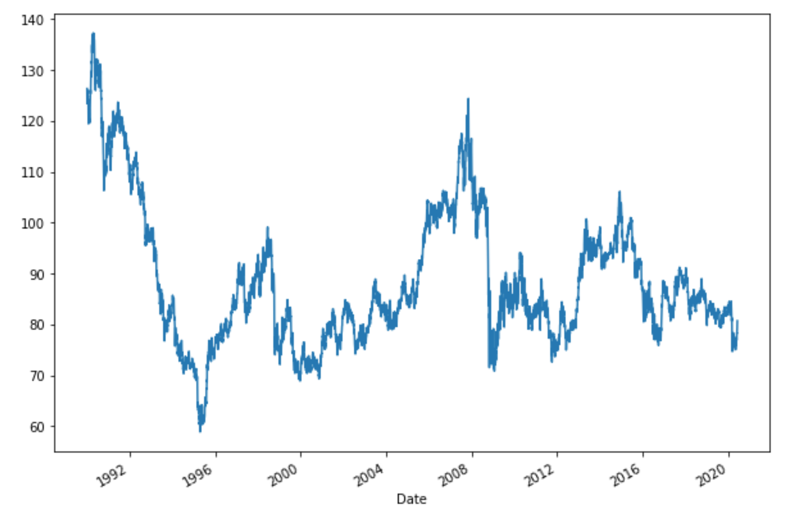
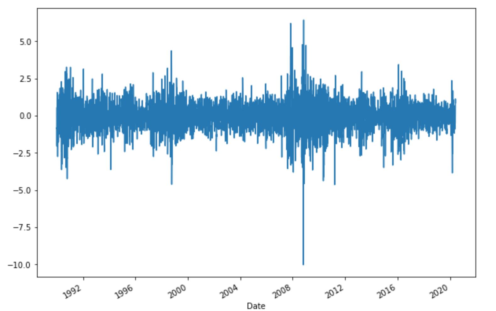
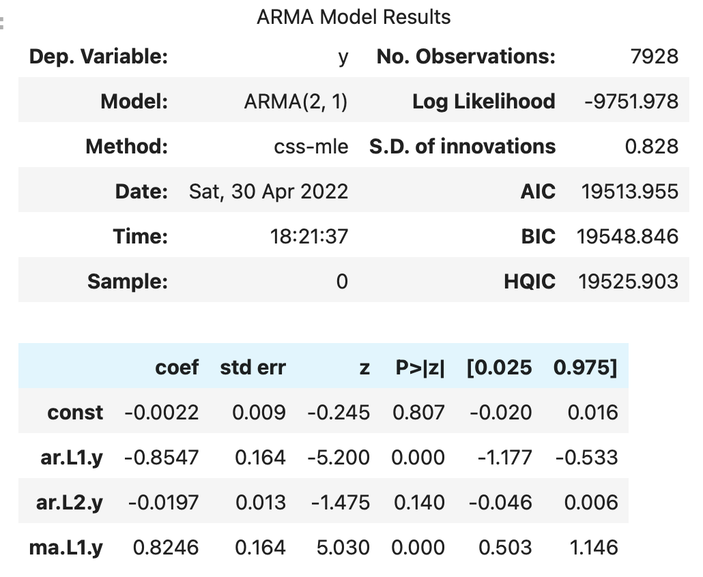
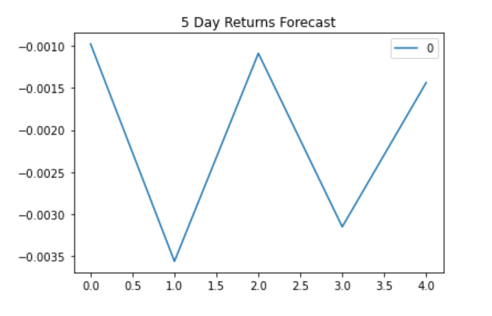
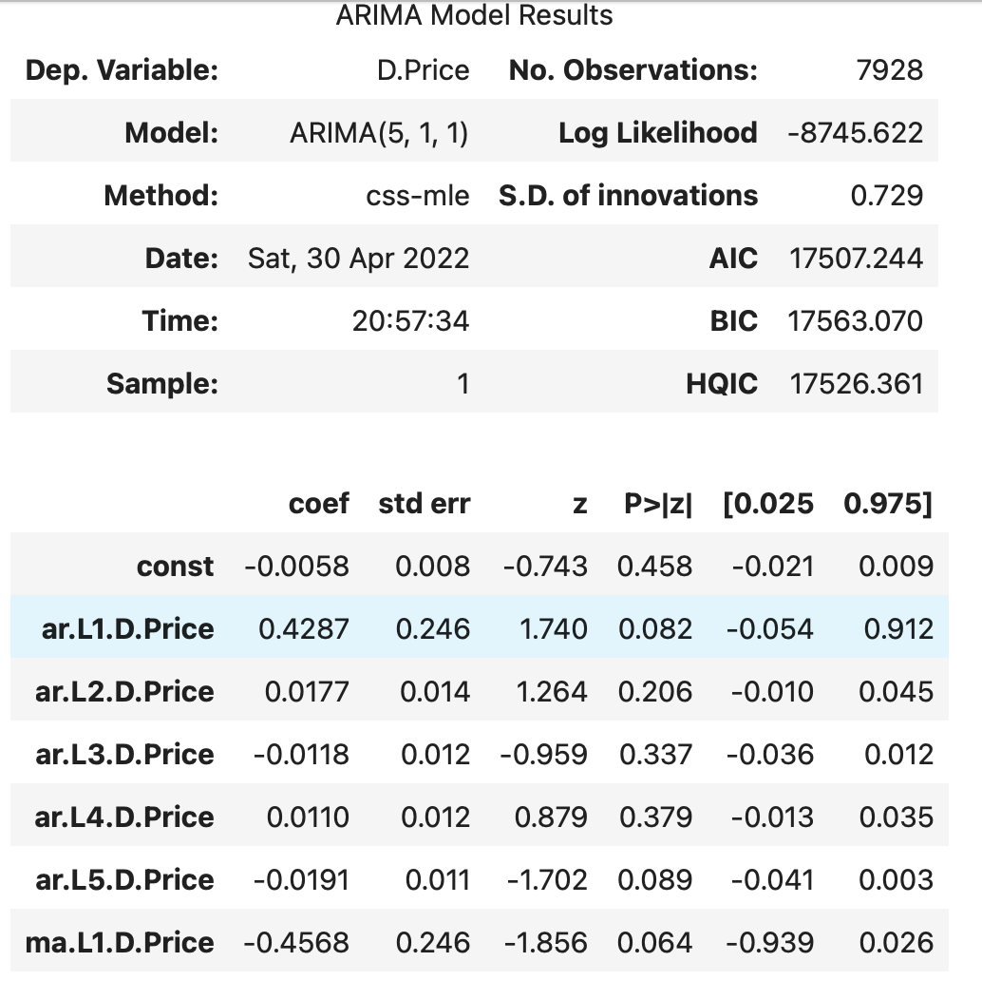
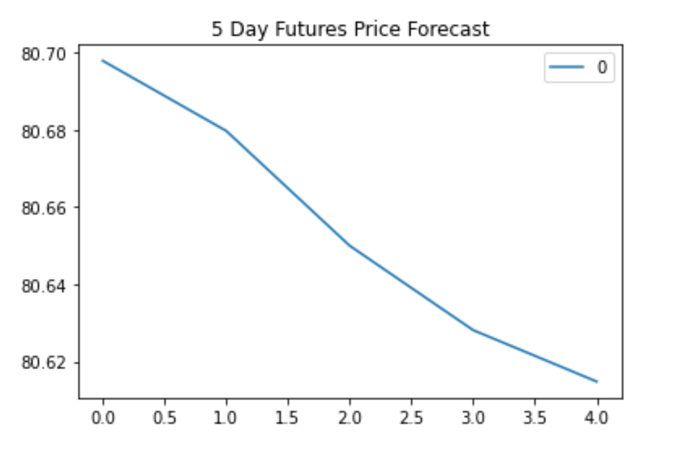
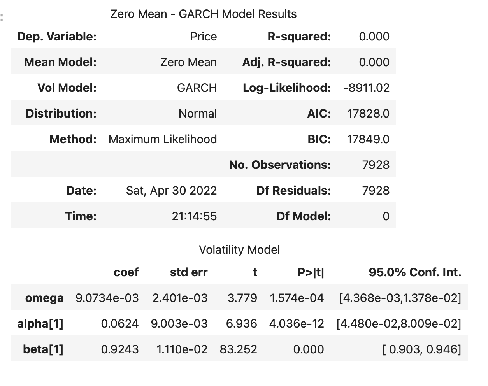

# 10_TimeSeriesAnalysis
 Predict future movements in the value of the Canadian dollar versus the Japanese yen using time series tools

# Unit 10—A Yen for the Future

1. Plotting the Settle price to check for long or short-term patterns.
   
    * The overall trend is downwards. There are high periods of volatility during end of the year - begining of next year where there is reversal in trends.

2. Decomposition using a Hodrick-Prescott filter (decompose the settle price into trend and noise).
    
     *  Do you see any patterns, long-term and/or short?
     *  There is high volatility. But lower highs and lower lows indicate downward trend.

3. Forecasting returns using an ARMA model.
    
    * Based on the p-value, is the model a good fit?
    *  The p-value for ARMA models is above 0.05 and few values are 0 which is a huge divergence. So its not a good fit

4. Forecasting the exchange rate price using an ARIMA model.
    
    * What does the model forecast will happen to the Japanese Yen in the near term?
    *  The ARIMA model indicates downwards trend for the Yen. However, the model is not accurate due to p-value higher than 0.05

5. Forecasting volatility with GARCH.
   
    * What does the model forecast will happen to volatility in the near term?
    *  The GARCH model indicates that volatility will increase. The model is accurate as well as the p-value is lower than 0.05

Use the results of the completed time series analysis and modelling to answer the following questions:

1. Based on your time series analysis, would you buy the yen now?
***I would not buy the Yen as the trend is downwards***
2. Is the risk of the yen expected to increase or decrease?
***The volatility, and hence the risk is expected to increase***
3. Based on the model evaluation, would you feel confident in using these models for trading?
***Volatility is good for short term trading, so I would probbaly use puts/short the yen, but maybe by considering additional chart analysis***

#### Linear Regression Forecasting
* Does this model perform better or worse on out-of-sample data compared to in-sample data?

***The model out-of-sample RMSE is ~0.64 while in-sample RMSE is ~0.84. The RMSE should be lower to indicate a better fit. In this case the model is performing better (low error) on out-of-sample data which is good***

***Time Series Plot***

***Noise Plot***

